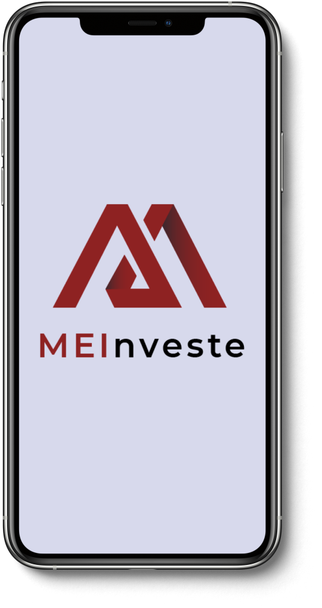

## MEInveste 🚀 em construção... 🚧

<h1 align ="center" display= 'flex'>
    </img>
</h1>

## 💻 Sobre o projeto
A MEInveste busca ajudar os microempreendedores a terem sucesso em seus negócios, levando segurança e descomplicando a burocracia dos serviços financeiros.
Procuramos ser a ponte entre pessoas que estão dispostas a investir e os empreendedores que precisam de capital para aplicar em seus negócios.


A MEInveste é uma plataforma de Marketplace Lending que também engloba o Peer to Peer Lending, ou seja, não fornecemos meramente empréstimos empresariais ou capital de giro.
Conectamos empresas que precisam de investimento com investidores, eliminando toda a burocracia e os procedimentos comuns das instituições financeiras.
Procuramos oferecer taxas de juros mais baratas para os tomadores de empréstimo e taxas de rentabilidades mais altas para os investidores
Afinal, se considerarmos o delicado momento da economia nacional, ter uma facilidade maior de acesso ao crédito e taxas de juros mais justas pode ser uma das saídas que o Brasil precisa para voltar a crescer e prosperar.

## 🛠 Tecnologias

- React Native
- Expo
- Typescript
- Axios

## :mag_right: Repositório Backend
https://github.com/ErickGledson/meinveste-backend

## 🎨 Layout
- [Figma](https://www.figma.com/file/eqiz0tbQhqvSf2TzJbu8O6/MEInvest?node-id=0%3A1)

## 🤖 Equipe
- [Bianca](https://github.com/bkkater)
- [Juliana](https://www.linkedin.com/in/juliana-talita-b683581b2/)
- [Eduarda](https://www.linkedin.com/in/eduarda-barboza-tavares-612a55159/)
- [Jhennifer](https://www.linkedin.com/in/jhennifer-pimentel-0518171b2/)
- [Erick](https://github.com/ErickGledson)


## 📏 Mentores
- [Uandisson ](https://www.linkedin.com/in/uandisson/)
- [Priscila Guedes](https://www.linkedin.com)
- [Jose Fernandes](https://www.linkedin.com)
- [Tiago Ortolani](https://www.linkedin.com)


### 📱 Como Rodar o Projeto
Para rodar o projeto mobile você precisa de um celular com o [expo](https://play.google.com/store/apps/details?id=host.exp.exponent) instlado ou um emulador android/ios.

```bash
# Vá para a pasta meinveste-mobile
$ cd meinveste-mobile
# Instale as depedencias
$ yarn install
# Rode a aplicação
$ yarn start
```
Depois leia o QRCode com o app do [expo](https://play.google.com/store/apps/details?id=host.exp.exponent) ou rode em um emulador.
